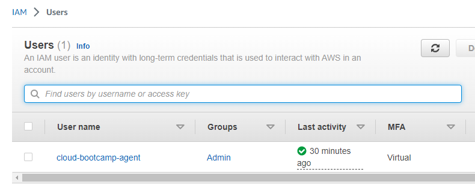
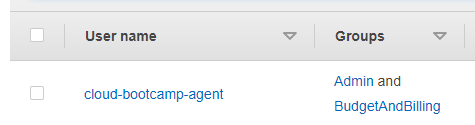
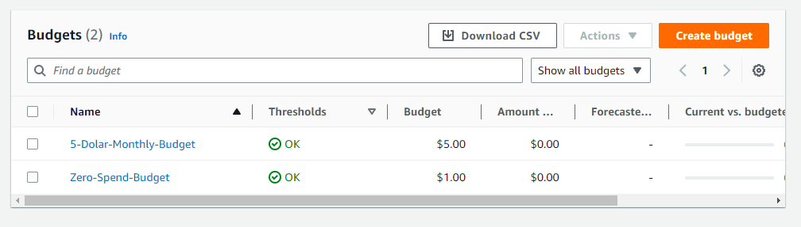
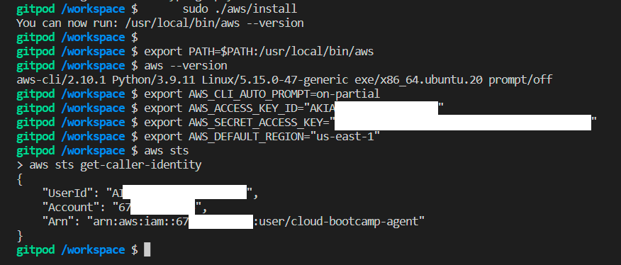
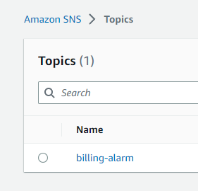
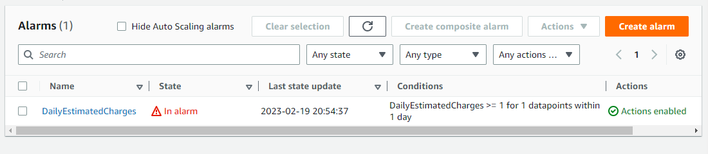
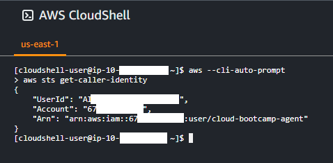
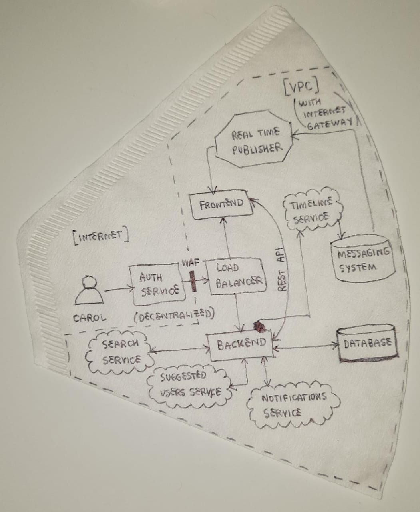
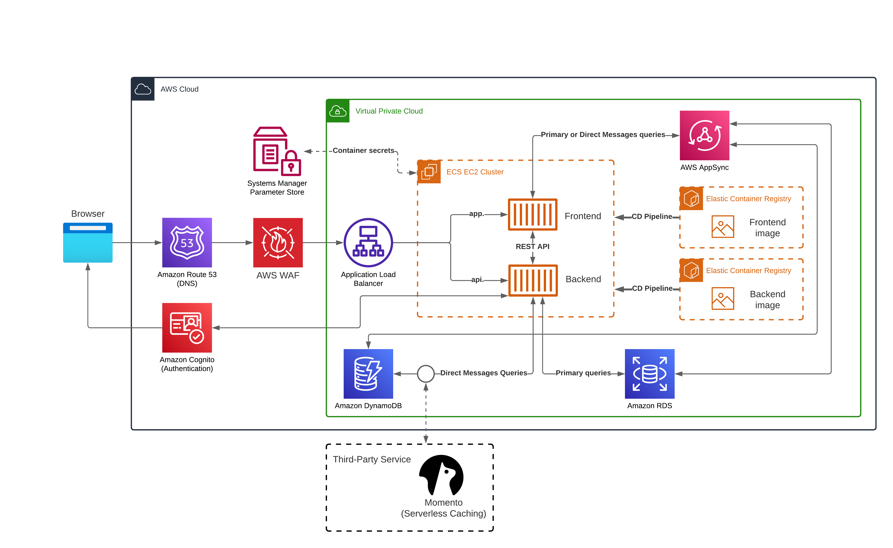
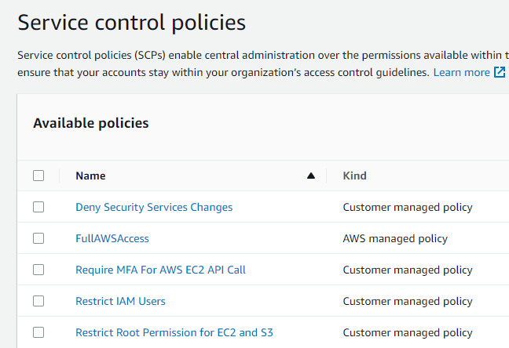

# Week 0 — Billing and Architecture

## 0 - Stakeholder Meeting

I took some notes while watching the [live stream](https://www.youtube.com/live/SG8blanhAOg?feature=share):

### 0.0 Project Scenario

I am responsible for the cloud infrasctructure of an application called Cruddr, which is an ephemeral microblogging website. The goal is to build an architecture around microservices considering the the 3 application layers: UI, Business Logic and Data Access. Also I should keep in mind the [Iron Triangle](https://www.mindtools.com/aa9j1zc/the-iron-triangle-of-project-management) concept when balancing cost, time and features. 

### 0.1 Involved people

Tony is my direct manager on the startup, we have the web development team working on our side, the investors - who mostly care about cost and timing - and our fractional CTO, with whom I can discuss about the technical requirements.


### 0.2 To do

I need to present a technical report for the investors detailing the proposed architecture, a budget and ongoing cost estimate.

## 1 - Homework Hard Assignments

### 2.0 Basic AWS Account configuration

I added MFA to my root account, then created a user group with AdministratorAccess policy attached. Then I added a new IAM user in this group to use along the bootcamp and added MFA to this user as well:



### 2.1 Budget

At first I had trouble configuring Billing and Budget access to my IAM user. Then I discovered that giving the permissions with policies is not enough: one also needs to [activate user access to Billing and Cost Management directly on root Account page](https://docs.aws.amazon.com/IAM/latest/UserGuide/tutorial_billing.html?icmpid=docs_iam_console#tutorial-billing-step1). 

So at the end, I have two user groups: Admin with AdministratorAccess policy, and BudgetAndBilling group with Billing and AWSBudgetsActionsWithAWSResourceControlAccess policies attached. Now my principal user is in both groups:



I then created two budgets: a zero spending budget to try to keep myself in free tier as much as possible, and a montly cost budget of U$ 5.00 to watch for my credits:



### 2.2 AWS CLI 

I [installed AWS CLI](https://docs.aws.amazon.com/cli/latest/userguide/getting-started-install.html) on Gitpod terminal, exported the installation folder to the PATH env variable, and enabled the on-partial auto prompt. Finally, I generated and exported my user credentials to be used on AWS CLI:



I also exported the credentials with gp env in order for them to not get reseted on next sessions:

```
gp env AWS_ACCESS_KEY_ID=
gp env AWS_SECRET_ACCESS_KEY=
gp env AWS_DEFAULT_REGION=
```

And then I updated the .gitpod.yml to install AWS CLI as instructed, link [here](https://github.com/carolinelds/aws-bootcamp-cruddur-2023/blob/main/.gitpod.yml). I had an issue related to the AWS CLI not being installed when restarting the Gitpod workspace, however I solved it after reading the [documentation](https://www.gitpod.io/docs/configure/workspaces/tasks#restart-a-workspace): I had to delete and create a new workspace in order for the init task to be executed.

### 2.3 Billing Alarm with AWS CLI

First, I enabled billing alerts on my root account. Then I created an SNS topic, verified the endpoint and then created an alarm. The following were the used commands:

```
aws sns create-topic --name billing-alarm

aws sns subscribe \
    --topic-arn="arn:aws:sns:us-east-1:<account-id>:billing-alarm" \
    --protocol=email \
    --notification-endpoint=<my-email>

aws cloudwatch put-metric-alarm --cli-input-json file://aws/json/billing_alarm_config.json
```

And the result:





### 2.4 CloudShell

I accessed it and used the following commands:
```
aws --cli-auto-prompt #activates auto-prompt
aws sts get-caller-identity #shows user info
```
 

After noticing the flag --cli-auto-prompt is only valid for the next command, I also [enabled auto-prompt with environment variable](https://docs.aws.amazon.com/cli/latest/userguide/cli-configure-envvars.html#envvars-list-aws_cli_auto_prompt) to work every time, using:

```
export AWS_CLI_AUTO_PROMPT=on
```

### 2.4 Architecture diagrams

First we have the conceptual diagram on something better than a napkin: a coffee filter =)



After I draw the logical diagram on Lucid Charts using [AWS architecture icons](https://aws.amazon.com/pt/architecture/icons/) (the PowerPoint with guidelines is just great!). The link to visualize is [here](https://lucid.app/lucidchart/f21007ac-66e4-49f3-8413-8ccb27a347cd/edit?viewport_loc=-59%2C74%2C1894%2C831%2C0_0&invitationId=inv_bc32d031-7b29-4936-a617-8c72b2a8b88c), and below there is a print:



## 2 - Homework Stretch Assignments


### 2.0 More AWS Account Configuration

On my root account I created an organization and then added some SCPs (Service Control Policies) to improve its security (see result in image below). I used the [templates from @hashishrajan](https://github.com/hashishrajan/aws-scp-best-practice-policies), one of our instructors.



I also went to configure a trail in CloudTrail to enable better security auditting. However, I deleted it since a new trail was not really needed for the bootcamp: [CloudTrail by default is enabled on every AWS account when we create it, and by default it already stores the past 90 days of activities](https://docs.aws.amazon.com/awscloudtrail/latest/userguide/how-cloudtrail-works.html) - and that is basically what I need, without the risk of surpassing free-tier.