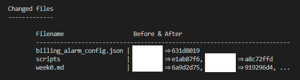
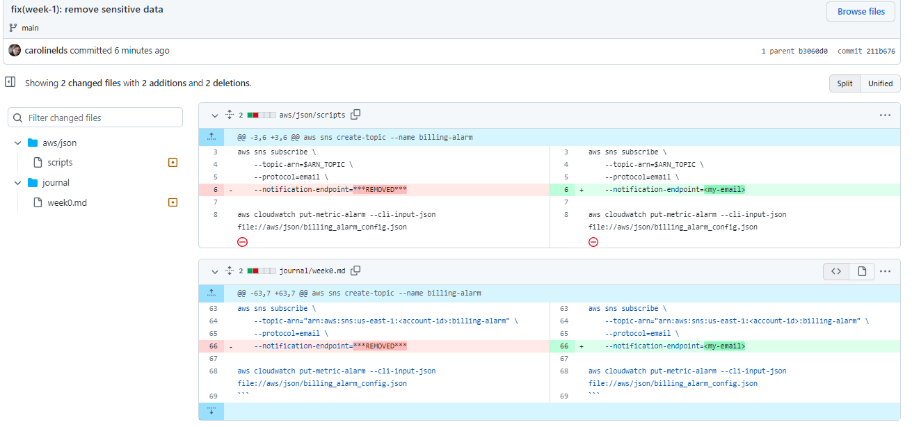

# Week 1 — App Containerization

## 1 - Homework Hard Assignments

## 2 - Homework Stretch Assignments

### 2.0 Cleaning Sensitive Data of GitHub Repo

I scanned my GitHub repository as suggested in [class](https://youtu.be/hseEfxCHzYw) using Trufflehog and BFG tools. 

#### *2.0.0 Trufflehog*

For [Trufflehog](https://github.com/trufflesecurity/trufflehog) I used the following commands and got the result on the image below, showing that no sensitive data was found:

```
brew install trufflesecurity/trufflehog/trufflehog
trufflehog git https://github.com/carolinelds/aws-bootcamp-cruddur-2023
```


#### *2.0.1 BFG*

For [BFG](https://rtyley.github.io/bfg-repo-cleaner/) first I created a .txt file outside of the repository folder with the data I want to replace (e.g. email, account id, etc). Then I used the following commands:

```
brew install bfg
cd /workspace && git clone --mirror https://github.com/carolinelds/aws-bootcamp-cruddur-2023.git bootcamp-mirror-bfg
cd bootcamp-mirror-bfg && bfg --replace-text /workspace/replacements.txt
git reflog expire --expire=now --all && git gc --prune=now --aggressive
git push
```

There was a commit protected by 'HEAD' that referenced two "dirty" files, so I made a new commit removing the sensitive data, and the run BFG to replace text again. It changed the following files history:



And we can see that it worked by checking the [aforementioned commit](https://github.com/carolinelds/aws-bootcamp-cruddur-2023/commit/211b676592813e8b1b44f85709c9243342a5b440) after BFG cleaning:




